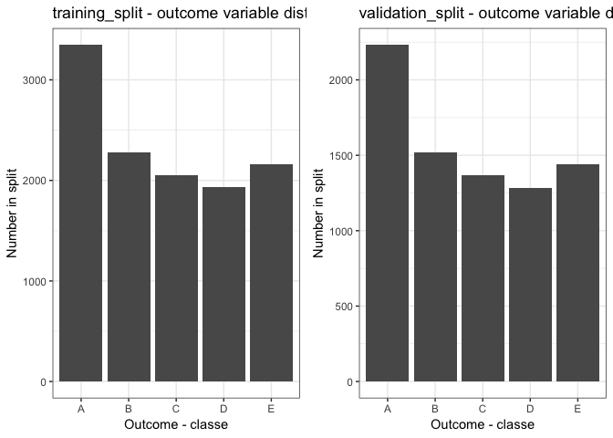
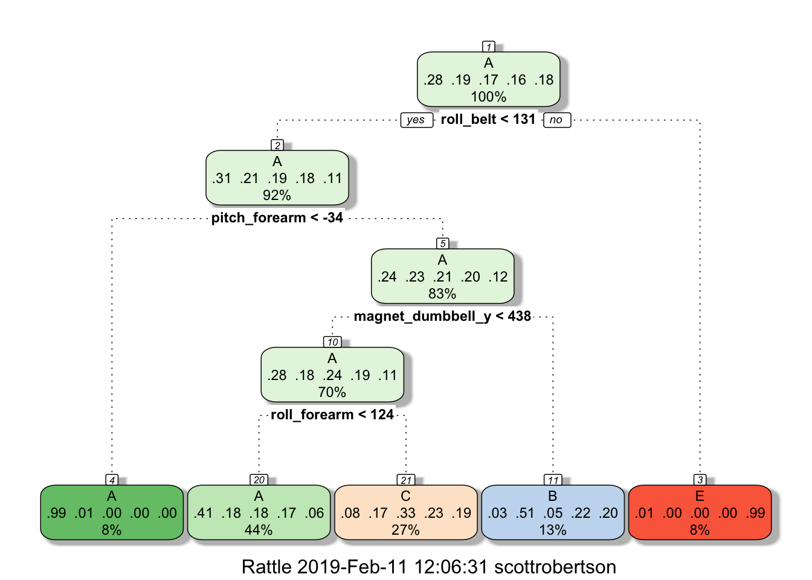

*os: macOS 10.14.2*  
*r version: 3.5.1*  
*required packages: readr, caret, knitr, kableExtra, rattle, rpart.plot, ggplot2, ggpubr*   

## Synopsis

The purpose of this paper is to document the development of a machine learning model that can categorise workout meassurements into one of 5 groups. As part of the development this will include testing a number of models and identifying the one with the lowest potential out of sample error.

## Environment prep


```r
# Installing required packages if not avaliable
if("readr" %in% rownames(installed.packages()) == FALSE){
      install.packages("readr")
}
if("caret" %in% rownames(installed.packages()) == FALSE){
      install.packages("caret")
}
if("knitr" %in% rownames(installed.packages()) == FALSE){
      install.packages("knitr")
}
if("kableExtra" %in% rownames(installed.packages()) == FALSE){
      install.packages("kableExtra")
}
if("rattle" %in% rownames(installed.packages()) == FALSE){
      install.packages("rattle")
}
if("rpart.plot" %in% rownames(installed.packages()) == FALSE){
      install.packages("rpart.plot")
}
if("ggplot2" %in% rownames(installed.packages()) == FALSE){
      install.packages("ggplot2")
}
if("ggpubr" %in% rownames(installed.packages()) == FALSE){
      install.packages("ggpubr")
}

# Load the nessecary packages into environment
library(readr)
library(caret)
library(knitr)
library(kableExtra)
library(rattle)
library(rpart.plot)
library(ggplot2)
library(ggpubr)

# Set global parameters
set.seed(42)
theme_set(theme_bw())
```

## Background

Using devices such as Jawbone Up, Nike FuelBand, and Fitbit it is now possible to collect a large amount of data about personal activity relatively inexpensively. These type of devices are part of the quantified self movement – a group of enthusiasts who take measurements about themselves regularly to improve their health, to find patterns in their behavior, or because they are tech geeks. One thing that people regularly do is quantify how much of a particular activity they do, but they rarely quantify how well they do it. In this project, your goal will be to use data from accelerometers on the belt, forearm, arm, and dumbell of 6 participants. They were asked to perform barbell lifts correctly and incorrectly in 5 different ways. More information is available from the website here: http://groupware.les.inf.puc-rio.br/har 

## Study data

[Write summary of data source]

The training data for this project are available here:

https://d396qusza40orc.cloudfront.net/predmachlearn/pml-training.csv

The test data are available here:

https://d396qusza40orc.cloudfront.net/predmachlearn/pml-testing.csv

The data for this project come from this source: http://groupware.les.inf.puc-rio.br/har. 


```r
# Create "data" folder within working directory to store information if not already avaliable
if (!file.exists("data")) {
      dir.create("data")
}

# Set URL to download files from
trainUrl <- "https://d396qusza40orc.cloudfront.net/predmachlearn/pml-training.csv"
testUrl <- "https://d396qusza40orc.cloudfront.net/predmachlearn/pml-testing.csv"

# Download files to data folder
download.file(trainUrl, "./data/training.csv")
download.file(testUrl, "./data/test.csv")

# Store date of download in a value
dateDownloaded <- Sys.time()

# Load data into environment
training <- read.csv("./data/training.csv", header = TRUE, sep = ",", na.strings = c("NA","",'#DIV/0!'))
test <- read.csv("./data/test.csv", header = TRUE, sep = ",", na.strings = c("NA","",'#DIV/0!'))

# Create a summary table for the dimensions of the training and test set
dim_raw <- data.frame(
  Dataset = c("Training", "Test"),
  Observations = c(dim(training)[1], dim(test)[1]),
  Variables =c(dim(training)[2], dim(test)[2])
)

# Print dim table as a kable object
kable(dim_raw) %>%
  kable_styling(bootstrap_options = "bordered", full_width = F)
```

<table class="table table-bordered" style="width: auto !important; margin-left: auto; margin-right: auto;">
 <thead>
  <tr>
   <th style="text-align:left;"> Dataset </th>
   <th style="text-align:right;"> Observations </th>
   <th style="text-align:right;"> Variables </th>
  </tr>
 </thead>
<tbody>
  <tr>
   <td style="text-align:left;"> Training </td>
   <td style="text-align:right;"> 19622 </td>
   <td style="text-align:right;"> 160 </td>
  </tr>
  <tr>
   <td style="text-align:left;"> Test </td>
   <td style="text-align:right;"> 20 </td>
   <td style="text-align:right;"> 160 </td>
  </tr>
</tbody>
</table>


## Cleaning the data

The training data that we have imported currently has 160 columns and 19622 observations. This is a large number of possible coefficients so we will need to do some cleaning to reduce the number. 

To start with we remove any columns that are more than 60% NAs or blank and any columns that have near zero variance. The contents of these columns will not have much of an impact on our predictions so can removed.


```r
# Remove blank or NA columns
training_mod <- training[, colSums(is.na(training)) == 0] 

# Identify any columns with near zero variance
var_training <- nearZeroVar(training_mod, saveMetrics=TRUE)
training_mod <- training_mod[,var_training$nzv==FALSE]

# Remove qualitative columns
training_mod <- training_mod[,-(1:6)]

# Check the structure and dimension of remaining data
dim(training_mod)
```

```
## [1] 19622    53
```

```r
str(training_mod)
```

```
## 'data.frame':	19622 obs. of  53 variables:
##  $ roll_belt           : num  1.41 1.41 1.42 1.48 1.48 1.45 1.42 1.42 1.43 1.45 ...
##  $ pitch_belt          : num  8.07 8.07 8.07 8.05 8.07 8.06 8.09 8.13 8.16 8.17 ...
##  $ yaw_belt            : num  -94.4 -94.4 -94.4 -94.4 -94.4 -94.4 -94.4 -94.4 -94.4 -94.4 ...
##  $ total_accel_belt    : int  3 3 3 3 3 3 3 3 3 3 ...
##  $ gyros_belt_x        : num  0 0.02 0 0.02 0.02 0.02 0.02 0.02 0.02 0.03 ...
##  $ gyros_belt_y        : num  0 0 0 0 0.02 0 0 0 0 0 ...
##  $ gyros_belt_z        : num  -0.02 -0.02 -0.02 -0.03 -0.02 -0.02 -0.02 -0.02 -0.02 0 ...
##  $ accel_belt_x        : int  -21 -22 -20 -22 -21 -21 -22 -22 -20 -21 ...
##  $ accel_belt_y        : int  4 4 5 3 2 4 3 4 2 4 ...
##  $ accel_belt_z        : int  22 22 23 21 24 21 21 21 24 22 ...
##  $ magnet_belt_x       : int  -3 -7 -2 -6 -6 0 -4 -2 1 -3 ...
##  $ magnet_belt_y       : int  599 608 600 604 600 603 599 603 602 609 ...
##  $ magnet_belt_z       : int  -313 -311 -305 -310 -302 -312 -311 -313 -312 -308 ...
##  $ roll_arm            : num  -128 -128 -128 -128 -128 -128 -128 -128 -128 -128 ...
##  $ pitch_arm           : num  22.5 22.5 22.5 22.1 22.1 22 21.9 21.8 21.7 21.6 ...
##  $ yaw_arm             : num  -161 -161 -161 -161 -161 -161 -161 -161 -161 -161 ...
##  $ total_accel_arm     : int  34 34 34 34 34 34 34 34 34 34 ...
##  $ gyros_arm_x         : num  0 0.02 0.02 0.02 0 0.02 0 0.02 0.02 0.02 ...
##  $ gyros_arm_y         : num  0 -0.02 -0.02 -0.03 -0.03 -0.03 -0.03 -0.02 -0.03 -0.03 ...
##  $ gyros_arm_z         : num  -0.02 -0.02 -0.02 0.02 0 0 0 0 -0.02 -0.02 ...
##  $ accel_arm_x         : int  -288 -290 -289 -289 -289 -289 -289 -289 -288 -288 ...
##  $ accel_arm_y         : int  109 110 110 111 111 111 111 111 109 110 ...
##  $ accel_arm_z         : int  -123 -125 -126 -123 -123 -122 -125 -124 -122 -124 ...
##  $ magnet_arm_x        : int  -368 -369 -368 -372 -374 -369 -373 -372 -369 -376 ...
##  $ magnet_arm_y        : int  337 337 344 344 337 342 336 338 341 334 ...
##  $ magnet_arm_z        : int  516 513 513 512 506 513 509 510 518 516 ...
##  $ roll_dumbbell       : num  13.1 13.1 12.9 13.4 13.4 ...
##  $ pitch_dumbbell      : num  -70.5 -70.6 -70.3 -70.4 -70.4 ...
##  $ yaw_dumbbell        : num  -84.9 -84.7 -85.1 -84.9 -84.9 ...
##  $ total_accel_dumbbell: int  37 37 37 37 37 37 37 37 37 37 ...
##  $ gyros_dumbbell_x    : num  0 0 0 0 0 0 0 0 0 0 ...
##  $ gyros_dumbbell_y    : num  -0.02 -0.02 -0.02 -0.02 -0.02 -0.02 -0.02 -0.02 -0.02 -0.02 ...
##  $ gyros_dumbbell_z    : num  0 0 0 -0.02 0 0 0 0 0 0 ...
##  $ accel_dumbbell_x    : int  -234 -233 -232 -232 -233 -234 -232 -234 -232 -235 ...
##  $ accel_dumbbell_y    : int  47 47 46 48 48 48 47 46 47 48 ...
##  $ accel_dumbbell_z    : int  -271 -269 -270 -269 -270 -269 -270 -272 -269 -270 ...
##  $ magnet_dumbbell_x   : int  -559 -555 -561 -552 -554 -558 -551 -555 -549 -558 ...
##  $ magnet_dumbbell_y   : int  293 296 298 303 292 294 295 300 292 291 ...
##  $ magnet_dumbbell_z   : num  -65 -64 -63 -60 -68 -66 -70 -74 -65 -69 ...
##  $ roll_forearm        : num  28.4 28.3 28.3 28.1 28 27.9 27.9 27.8 27.7 27.7 ...
##  $ pitch_forearm       : num  -63.9 -63.9 -63.9 -63.9 -63.9 -63.9 -63.9 -63.8 -63.8 -63.8 ...
##  $ yaw_forearm         : num  -153 -153 -152 -152 -152 -152 -152 -152 -152 -152 ...
##  $ total_accel_forearm : int  36 36 36 36 36 36 36 36 36 36 ...
##  $ gyros_forearm_x     : num  0.03 0.02 0.03 0.02 0.02 0.02 0.02 0.02 0.03 0.02 ...
##  $ gyros_forearm_y     : num  0 0 -0.02 -0.02 0 -0.02 0 -0.02 0 0 ...
##  $ gyros_forearm_z     : num  -0.02 -0.02 0 0 -0.02 -0.03 -0.02 0 -0.02 -0.02 ...
##  $ accel_forearm_x     : int  192 192 196 189 189 193 195 193 193 190 ...
##  $ accel_forearm_y     : int  203 203 204 206 206 203 205 205 204 205 ...
##  $ accel_forearm_z     : int  -215 -216 -213 -214 -214 -215 -215 -213 -214 -215 ...
##  $ magnet_forearm_x    : int  -17 -18 -18 -16 -17 -9 -18 -9 -16 -22 ...
##  $ magnet_forearm_y    : num  654 661 658 658 655 660 659 660 653 656 ...
##  $ magnet_forearm_z    : num  476 473 469 469 473 478 470 474 476 473 ...
##  $ classe              : Factor w/ 5 levels "A","B","C","D",..: 1 1 1 1 1 1 1 1 1 1 ...
```

Of the remaining data, columns 1-6 contain qualitative data about the exercise as opposed to meassurements of the exercise. These can be dropped for the purposed of model building to leave 1 outcome and 52 predictor variables in our data set. 

To ensure accuracy later we also apply these transformations to the test data set and produce a table to check that they still have the same dimensions.


```r
# Perform transformations on test data set
test_mod <- test[, colSums(is.na(test)) == 0] 

var_test <- nearZeroVar(test_mod, saveMetrics=TRUE)
test_mod <- test_mod[,var_test$nzv==FALSE]

test_mod <- test_mod[,-(1:6)]

# Create a summary table for the dimensions of the training and test set
dim_mod <- data.frame(
  Dataset = c("Training Mod", "Test Mod"),
  Observations = c(dim(training_mod)[1], dim(test_mod)[1]),
  Variables =c(dim(training_mod)[2], dim(test_mod)[2])
)

# Print dim table as a kable object
kable(dim_mod) %>%
  kable_styling(bootstrap_options = "bordered", full_width = F)
```

<table class="table table-bordered" style="width: auto !important; margin-left: auto; margin-right: auto;">
 <thead>
  <tr>
   <th style="text-align:left;"> Dataset </th>
   <th style="text-align:right;"> Observations </th>
   <th style="text-align:right;"> Variables </th>
  </tr>
 </thead>
<tbody>
  <tr>
   <td style="text-align:left;"> Training Mod </td>
   <td style="text-align:right;"> 19622 </td>
   <td style="text-align:right;"> 53 </td>
  </tr>
  <tr>
   <td style="text-align:left;"> Test Mod </td>
   <td style="text-align:right;"> 20 </td>
   <td style="text-align:right;"> 53 </td>
  </tr>
</tbody>
</table>


## Preparing data for model building

Now that we have reduced the dimension in the data set we can start work on building our prediction algorithms. The size of the testing set provided is small, only 20 observations, and due to the role of this data in testing the final model we will not use this to develop the model.

In order to perform accuracte development we will further split the training data set by spliting it into a training and validation set. As we have a large number of self contained events we will perform a 60/40 split which will ensure represtive samples.

We will also create a training control value to use in our future model building. This contol will be used in all subsequent models so that they perform 5 fold cross validation as part of the model build.


```r
# Use create data partition to split the training data set
split <- createDataPartition(training_mod$classe, p=0.6, list=FALSE)
training_split <- training_mod[split,]
validation_split <- training_mod[-split,]

# Create a summary table for the dimensions of the training and test set
dim_split <- data.frame(
  Dataset = c("Training Split", "Validation Split"),
  Observations = c(dim(training_split)[1], dim(validation_split)[1]),
  Variables =c(dim(training_split)[2], dim(validation_split)[2])
)

# Print dim table as a kable object
kable(dim_split) %>%
  kable_styling(bootstrap_options = "bordered", full_width = F)
```

<table class="table table-bordered" style="width: auto !important; margin-left: auto; margin-right: auto;">
 <thead>
  <tr>
   <th style="text-align:left;"> Dataset </th>
   <th style="text-align:right;"> Observations </th>
   <th style="text-align:right;"> Variables </th>
  </tr>
 </thead>
<tbody>
  <tr>
   <td style="text-align:left;"> Training Split </td>
   <td style="text-align:right;"> 11776 </td>
   <td style="text-align:right;"> 53 </td>
  </tr>
  <tr>
   <td style="text-align:left;"> Validation Split </td>
   <td style="text-align:right;"> 7846 </td>
   <td style="text-align:right;"> 53 </td>
  </tr>
</tbody>
</table>

We also create plots to show the distrbution of the predictor classe in the training and validation sets to ensure they are representative.


```r
# Print comparator graph to ensure even distrbution of class
figure1 <- ggplot(aes(x = classe), data = training_split) +
                          geom_bar() +
                          labs(x = "Outcome - classe",
                               y = "Number in split",
                               title = "training_split - outcome variable distribution")

figure2 <- ggplot(aes(x = classe), data = validation_split) +
                          geom_bar() +
                          labs(x = "Outcome - classe",
                               y = "Number in split",
                               title = "validation_split - outcome variable distribution")

ggarrange(figure1, figure2, ncol=2, nrow=1)
```

<!-- -->

Now that we are happy that the training and validation sets are ready we create a control item so that we can ensure that future models use cross-validation during the training phase.


```r
# Create a training control function for model development
control <- trainControl(method = "cv", number = 5, verboseIter = F)
```

## Decision tree

The first model we will try is a decision tree. As covered in the training material it is best to start with a simple method and then build from there.


```r
# Train decision tree model
model_rpart <- train(classe ~ .,
                data = training_split,
                method = "rpart",
                trControl = control)

# Print out the details of the model
print(model_rpart$finalModel, digits=3)
```

```
## n= 11776 
## 
## node), split, n, loss, yval, (yprob)
##       * denotes terminal node
## 
##  1) root 11776 8430 A (0.28 0.19 0.17 0.16 0.18)  
##    2) roll_belt< 130 10791 7450 A (0.31 0.21 0.19 0.18 0.11)  
##      4) pitch_forearm< -33.7 970    8 A (0.99 0.0082 0 0 0) *
##      5) pitch_forearm>=-33.7 9821 7440 A (0.24 0.23 0.21 0.2 0.12)  
##       10) magnet_dumbbell_y< 438 8283 5950 A (0.28 0.18 0.24 0.19 0.11)  
##         20) roll_forearm< 124 5138 3050 A (0.41 0.18 0.18 0.17 0.057) *
##         21) roll_forearm>=124 3145 2100 C (0.076 0.17 0.33 0.23 0.19) *
##       11) magnet_dumbbell_y>=438 1538  757 B (0.032 0.51 0.046 0.22 0.2) *
##    3) roll_belt>=130 985    8 E (0.0081 0 0 0 0.99) *
```

```r
# Predict on validation data
predict_rpart <- predict(model_rpart, validation_split)

# Create confusion matrix to compare predicted values to actual values
matrix_rpart <- confusionMatrix(validation_split$classe, predict_rpart)

# Print the outcome of the predictions on validation data
matrix_rpart
```

```
## Confusion Matrix and Statistics
## 
##           Reference
## Prediction    A    B    C    D    E
##          A 2024   41  161    0    6
##          B  625  515  378    0    0
##          C  644   39  685    0    0
##          D  573  245  468    0    0
##          E  230  188  370    0  654
## 
## Overall Statistics
##                                           
##                Accuracy : 0.4943          
##                  95% CI : (0.4831, 0.5054)
##     No Information Rate : 0.522           
##     P-Value [Acc > NIR] : 1               
##                                           
##                   Kappa : 0.3388          
##  Mcnemar's Test P-Value : NA              
## 
## Statistics by Class:
## 
##                      Class: A Class: B Class: C Class: D Class: E
## Sensitivity            0.4941  0.50097  0.33220       NA  0.99091
## Specificity            0.9445  0.85289  0.88192   0.8361  0.89034
## Pos Pred Value         0.9068  0.33926  0.50073       NA  0.45354
## Neg Pred Value         0.6309  0.91893  0.78743       NA  0.99906
## Prevalence             0.5220  0.13102  0.26281   0.0000  0.08412
## Detection Rate         0.2580  0.06564  0.08731   0.0000  0.08335
## Detection Prevalence   0.2845  0.19347  0.17436   0.1639  0.18379
## Balanced Accuracy      0.7193  0.67693  0.60706       NA  0.94063
```

The accuracy acheived from this model is only 50.3% which is very low. 

If we visualise the model using rattle we can also see that with the current random seed the model is unable to predict all classes. 


```r
# Create rattle plot for final model
figure3 <- fancyRpartPlot(model_rpart$finalModel)
```

<!-- -->

Based on these results a decision tree on its own is not a good algorithm to use. As such we will need to try another alogrithm, in this case random forest.

## Random Forest

Random forests use layred decision trees to identify the optimal branches for prediction. As such we should expect to see a good increase in accuracy over the standard decision tree model.


```r
# Train random forest model
model_rf <- train(classe ~.,
                data = training_split,
                method = "rf", 
                trControl = control)

# Print out model summary
print(model_rf$finalModel, digits=3)
```

```
## 
## Call:
##  randomForest(x = x, y = y, mtry = param$mtry) 
##                Type of random forest: classification
##                      Number of trees: 500
## No. of variables tried at each split: 2
## 
##         OOB estimate of  error rate: 0.83%
## Confusion matrix:
##      A    B    C    D    E  class.error
## A 3345    1    0    1    1 0.0008960573
## B   13 2258    8    0    0 0.0092145678
## C    1   17 2033    3    0 0.0102239533
## D    0    0   43 1884    3 0.0238341969
## E    0    0    0    7 2158 0.0032332564
```

```r
# Predict on validation set
predict_rf <- predict(model_rf, validation_split)

# Create confusion matric to compare predicted labels to actual labels
matrix_rf <- confusionMatrix(validation_split$classe, predict_rf)

# Print the outcome based on validation prediction
matrix_rf
```

```
## Confusion Matrix and Statistics
## 
##           Reference
## Prediction    A    B    C    D    E
##          A 2231    1    0    0    0
##          B    5 1510    3    0    0
##          C    0   14 1352    2    0
##          D    0    0   26 1259    1
##          E    0    0    0    7 1435
## 
## Overall Statistics
##                                           
##                Accuracy : 0.9925          
##                  95% CI : (0.9903, 0.9943)
##     No Information Rate : 0.285           
##     P-Value [Acc > NIR] : < 2.2e-16       
##                                           
##                   Kappa : 0.9905          
##  Mcnemar's Test P-Value : NA              
## 
## Statistics by Class:
## 
##                      Class: A Class: B Class: C Class: D Class: E
## Sensitivity            0.9978   0.9902   0.9790   0.9929   0.9993
## Specificity            0.9998   0.9987   0.9975   0.9959   0.9989
## Pos Pred Value         0.9996   0.9947   0.9883   0.9790   0.9951
## Neg Pred Value         0.9991   0.9976   0.9955   0.9986   0.9998
## Prevalence             0.2850   0.1944   0.1760   0.1616   0.1830
## Detection Rate         0.2843   0.1925   0.1723   0.1605   0.1829
## Detection Prevalence   0.2845   0.1935   0.1744   0.1639   0.1838
## Balanced Accuracy      0.9988   0.9944   0.9883   0.9944   0.9991
```

With the shift to random forest algorithm the accuracy has increased to 99.2%, with an expected OOB error rate of 0.83%. As this is less than 1% I am happy to proceed with this as mu predction model.

## Predictions

Now that we have our algorithm we can use this on the test set to get our answers for the quiz section of the assignment.


```r
test <- predict(model_rf, test_mod)

print(test)
```

```
##  [1] B A B A A E D B A A B C B A E E A B B B
## Levels: A B C D E
```
